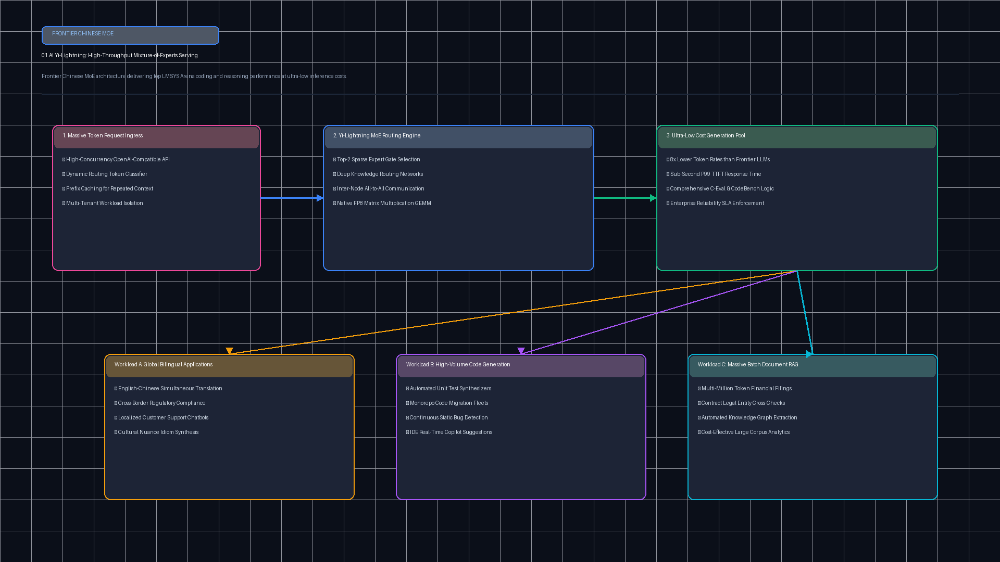
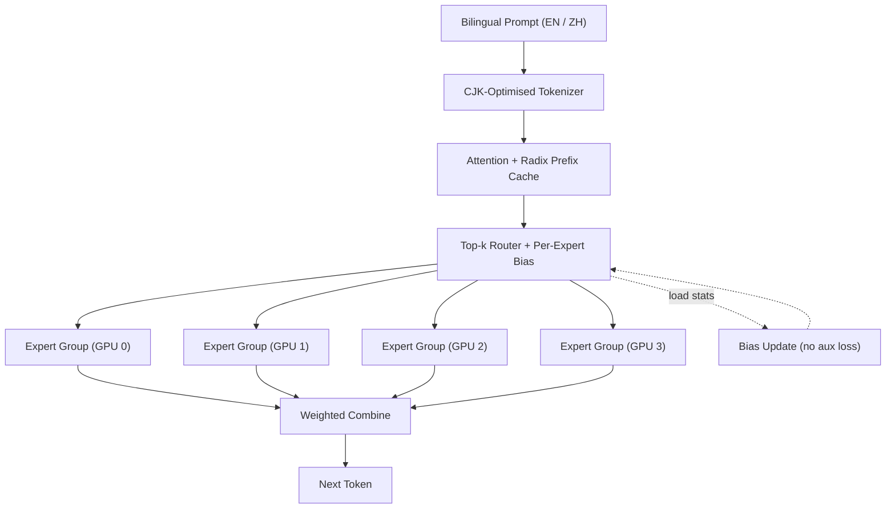

# 01.AI Yi-Lightning MoE Reference Runtime (`tp-yi-lightning-moe`)

[](https://github.com/Pradeeptalari14/tp-yi-lightning-moe/actions)
[](LICENSE)
[](https://python.org)

Reference toolkit for understanding and planning **fine-grained Mixture-of-Experts** serving, inspired by 01.AI's **Yi-Lightning**: aux-loss-free expert routing, bilingual (EN/ZH) token budgeting, and SGLang expert-parallel deployment.

> [!NOTE]
> Yi-Lightning is served via the 01.AI API; its weights and exact architecture are **not public**. The expert counts (64 experts, top-8) and sizes used here are an **illustrative reference configuration**, not official specifications.

---

## 🏗️ Architecture





---

## 🚀 What's Inside

| File | Purpose |
|---|---|
| [`moe_expert_router.py`](moe_expert_router.py) | Top-k gating with aux-loss-free bias balancing; self-checks that balancing lowers load imbalance (coefficient of variation) |
| [`bilingual_token_estimator.py`](bilingual_token_estimator.py) | Heuristic EN/ZH token estimates for KV-cache and cost sizing |
| [`scripts/validate.sh`](scripts/validate.sh) | Compile + run all modules (used by CI) |

---

## 📦 Quickstart

```bash
bash scripts/validate.sh
```

### Calling Yi-Lightning (hosted API)
01.AI's platform exposes an OpenAI-compatible endpoint:

```python
from openai import OpenAI

client = OpenAI(base_url="https://api.lingyiwanwu.com/v1", api_key="YOUR_01AI_KEY")
resp = client.chat.completions.create(
    model="yi-lightning",
    messages=[{"role": "user", "content": "用中文和英文解释混合专家模型。"}],
)
print(resp.choices[0].message.content)
```

### Self-hosting a comparable open MoE (SGLang)
```bash
python -m sglang.launch_server --model-path <open-moe-model> \
  --tp 4 --enable-ep-moe --quantization fp8 --context-length 131072
```

---

## 📄 License & Security

MIT — see [LICENSE](LICENSE) and [SECURITY.md](SECURITY.md).
